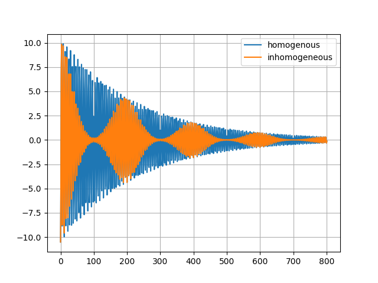

# NMR

## Foreword
This repository belongs to one of the lab experiments I did during
my Masters in Physics. 
The idea of the experiment is to teach the students the basics of 
nuclear magnetic resonance. 
Since I thought that the topic was interesting to program, I created this repo.
Currently, only gradients in the xy-plane are allowed and a 2D sample is needed.
However, I will maybe add a z gradient in the future.

In the Jupyter notebooks, which can be found in the `experiments` directory, some parts of the experiment are redone using the 
simulation.

In `basics.ipynb`, I briefly describe the differences between the simulation
and a real measurement. I also briefly outline the basics of NMR. 
(`basics.ipynb` is not ready yet and just a sketch)

A script for the Fourier-transformation `numba_ft.py` was taken from:
https://github.com/tloredo/AAS237-TimeSeries  
In case you do not want to use numba another version without it can be found there.

## Experiments
At the moment notebooks regarding:
- measurement of T1
- measurement of T2
- measurement of a 1D profile

are available.

## Usage
Two different versions of the code exist. 
The first one is given in `main.py`. It holds the numba version and thus
a bit faster. 

The second version is given in `no_numba.py`. It does not use numba.
Therefore, the simulation is a bit easier to read and work with. 
It also allows the capture of such animations about the 
dephasing and phasing of spins. The rephasing puls is send at `Time 50.0`.
The decreasing amplitude (radius) is intentional as it simplifies the simulation. 
This is further explained in the `basics.ipynb` notebook.

